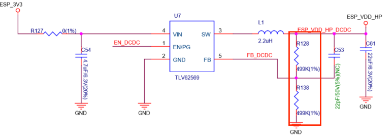
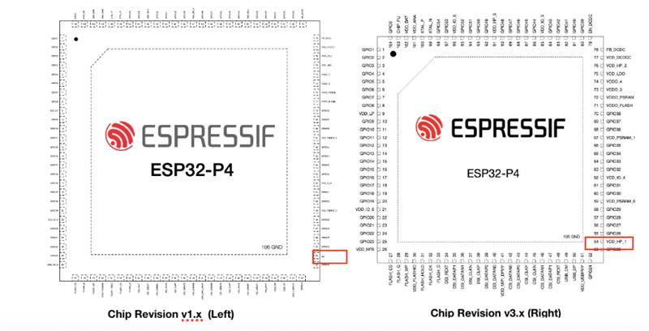
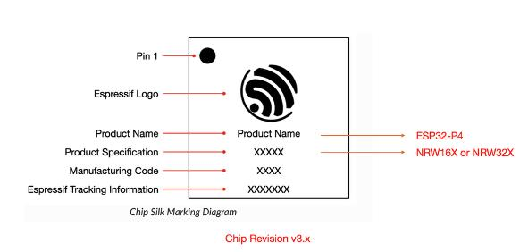
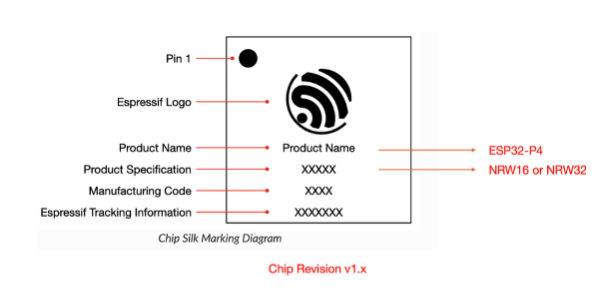

# ESP32-P4 Chip Revision v3.2 Sample Notes

Espressif Systems' high-performance MCU AIoT SoC, ESP32-P4 chip revision v3.2, has entered a new round of engineering sample stage. We greatly appreciate your trust in Espressif and our products, and we are honored to provide you with engineering samples based on the latest chip revision to assist with your basic functionality testing and firmware development work.

The Secure Download feature defect present in chip revision v3.1 has been fixed in chip revision v3.2. Chip revision v3.2 is fully software and hardware compatible with v3.1 and earlier versions. However, it is important to note that the chip revision v3.x (v3.0, v3.1, v3.2) is incompatible with chip revisions v1.x (v1.0, v1.1, v1.2, v1.3) in both software and hardware. The chip marking has changed from "NRW16 or NRW32" to "NRW16X or NRW32X" (see Appendix C for details). To ensure smooth development, we have compiled the following key considerations that you and your engineering team must be aware of.

**A. Chip revision v3.2 has the following known issues:**

1. esptool incompatibility: Older versions of esptool need to be upgraded to the latest version (esptool commit: 3f6cb598). Additionally, you need to configure menuconfig > Serial flasher config > Disable download stub (default value) to disable the stub to support flashing firmware onto the ESP32-P4 chip revision v3.2. This issue will be fixed in the next esptool release. Please monitor esptool for updates. To update esptool, run the following command in the ESP-IDF environment:

    `pip install git+https://github.com/espressif/esptool.git`

2. RTC_WDT reset issue: If the chip does not have an external 32.768 kHz crystal oscillator connected, do not enable this oscillator in the software (it is disabled by default in the software). Otherwise, enabling it may cause an RTC watchdog to reset due to calibration timeout. This issue has been fixed in the latest ESP-IDF version (commit id: fa9f68c), and the fix will be included in future ESP-IDF releases v5.5.5 and v6.0.1.

**B. For users upgrading from chip revisions v1.x to chip revision v3.2, please note the following:**

1. Software incompatibility: The chip revision v3.2 includes more than 50 hardware and register changes (covering ISP, CPU, L2MEM, MSPI, security modules, etc.). Old firmware from v1.x cannot run. Please refer to Appendix A on the second page to update ESP-IDF and the corresponding compilation toolchain, and recompile your project.

2. Pin change (Pin 54): The Pin 54 definition has been changed from NC (Not Connected) to VDD_HP power pin. Please refer to Appendix B for specific impacts and design recommendations.

3. DCDC Feedback Voltage Divider Resistors: For the DCDC power chip externally connected to the VDD_HP power supply, please ensure that the two 499 kΩ feedback voltage divider resistors and the 22 pF feedforward capacitor on its periphery must be populated. For specific impacts and design recommendations, please refer to Appendix B.

4. CPU frequency increase: CPU frequency limitations have been removed. The current samples support 400 MHz operating frequency.

**C. For users upgrading from chip revision v3.1 to v3.2, please note:**

1. Security fix: The Secure Download feature is fixed in chip revision v3.2.

2. The chip revision v3.2 is software-compatible with the chip revision v3.0 and v3.1, with no pin changes, except for the RTC_WDT note mentioned above.

3. The online version of the sample note can be accessed by scanning the QR code below or by clicking the [link](https://www.espressif.com.cn/sites/default/files/ae/ESP32-P4%20(Revision%20V3.2)%20Engineering%20Sample%20Notes_EN.pdf).

    

# Appendix A: Notes on ESP-IDF for ESP32-P4 { .pdf-break-before }

Currently, ESP-IDF release/v5.5 and release/v6.0 branches (https://github.com/espressif/esp-idf) support most features of the ESP32-P4 chip revision v3.2. We recommend that you frequently update the ESP-IDF branch to get the latest feature support and bug fixes.

|  ESP-IDF Versions/Branches    | Estimated Supported Version   |
|  ----  | ----  |
| release/v5.5   | v5.5.4 and later versions  |
| release/v6.0   | v6.0 and later versions  |

If this is your first time using ESP-IDF, we recommend starting with the ESP32-P4 software development environment and documentation:

<https://docs.espressif.com/projects/esp-idf/en/latest/esp32p4/index.html>

**Notice:**

1. Please set the ESP32-P4 development project using the following command:

    `idf.py set-target esp32p4`

2. Please note that before using the current ESP32-P4 chip revision v3.2, you must upgrade to the above ESP-IDF version or branch.

3. If you encounter flashing issues, update esptool in your ESP-IDF environment using the command:

    `pip install git+https://github.com/espressif/esptool.git`

# Appendix B: Notes on ESP32-P4 Pin Change { .pdf-break-before }

The ESP32-P4 chip revision v3.x differs from v1.x and earlier versions in pin design: Pin 54 has been changed from NC (Not Connected) to VDD_HP power pin. The chip revision v3.1 is consistent with v3.0.

- For new projects that have not yet started PCB design:

    - When using the chip revision v3.2, please externally connect the new power pin (Pin 54) to the VDD_HP power supply for optimal performance.

- For PCBs still using designs based on ESP32-P4 chip revisions v1.x:

    - Even if the new power pin (Pin 54) is not externally connected to the VDD_HP power supply, it will not affect the normal functionality of the chip. However, it is recommended to add this power connection in subsequent PCB revisions for optimal performance.
    - Component placement adjustment: For the DCDC power chip externally connected to the VDD_HP power supply, ensure that the two 499 kΩ feedback voltage divider resistors on its periphery must be populated; otherwise, there is a risk of chip damage.
    - Feedforward capacitor: Please populate the 22 pF feedforward capacitor for C53.

**Pin Change on ESP32-P4**

# Appendix C: Notes on ESP32-P4 Chip Marking Change { .pdf-break-before }

After the ESP32-P4 chip revision v3.x, the product specification identifier has changed from "NRW16 or NRW32" to "NRW16X or NRW32X", adding the suffix letter "X" to represent the chip revision upgrade.

